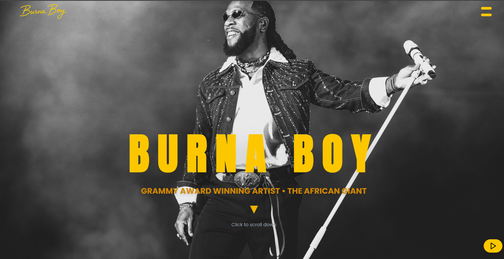

# 🎵 Burna Boy GSAP Music Website 🎶

Welcome to the **Burna Boy GSAP Music Website**! This is a sleek, modern, and interactive music website dedicated to the Grammy Award-winning artist Burna Boy. It features smooth animations powered by GSAP, a responsive layout, and an immersive user experience.

---

## 🚀 Project Preview



---

## 🛠️ Technologies Used

- **React**: A powerful JavaScript library for building user interfaces.
- **GSAP (GreenSock Animation Platform)**: For smooth, high-performance animations.
- **Tailwind CSS**: Utility-first CSS framework for rapid UI development.
- **React Router**: For client-side routing and navigation.
- **Vite**: Next-generation frontend tooling for fast development.
- **Lucide React**: Icon library used for play/pause buttons.
- **JavaScript (ES6+)**: Modern JavaScript features for clean and efficient code.

---

## ✨ Features

- 🎸 Animated Navbar with hamburger menu and smooth slide-in panel.
- 🌟 Hero section with fade-in and bounce arrow animations.
- 🎧 Music player with autoplay and user-controlled play/pause.
- 📱 Fully responsive design for all screen sizes.
- 🖤 Dark theme with vibrant yellow accents matching Burna Boy's branding.
- 🚦 Loading screen with smooth transition to main content.

---

## 📁 Project Structure

- `src/layouts/Navbar.jsx` - Navigation bar with animated menu.
- `src/sections/Hero.jsx` - Hero section with animated title and scroll arrow.
- `src/components/MusicPlayer.jsx` - Audio player with autoplay and controls.
- `src/App.jsx` - Main application component managing loading and layout.
- `public/` - Static assets including images and audio files.

---

## 🎯 Getting Started

1. Clone the repository:
   ```bash
   git clone https://github.com/noeljr2306/burnaboy-website.git
   ```
2. Install dependencies:
   ```bash
   npm install
   ```
3. Run the development server:
   ```bash
   npm run dev
   ```
4. Open your browser and navigate to the port shown on your browser

---

## 🤝 Contributing

Contributions are welcome! Feel free to open issues or submit pull requests for improvements and new features.

---


## 🙌 Acknowledgments

Special thanks to Burna Boy for the inspiration and to the open-source community for the amazing tools used in this project.

---

Enjoy the music and smooth animations! 🎶🔥
